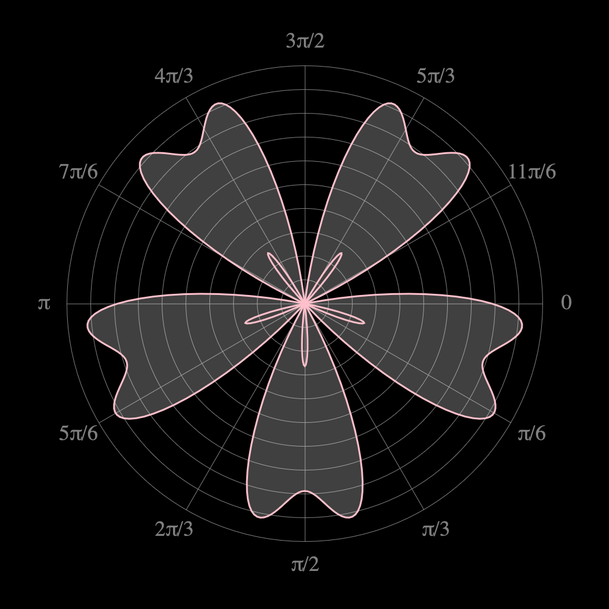

a grab bag of html5 canvas experiments:

## 2d-path-trace

2d real-time path tracing over a series of circles
rendering applied to give it a sense of depth from the viewer

## bezier-splines

iirc: define a spline as a small series of points
using the points, determine the handles between the points
draw the splines as line segments and also visualize their control handles

## koch-snowflake

[koch snowflake](https://en.wikipedia.org/wiki/Koch_snowflake) visualization with different configs

## nautilus

experimenting with different polar plotting and shape drawing

## nazar-sigaher-frame-clock

a canvas version of [this clock](https://homeli.co.uk/frame-clock-by-nazar-sigaher/)

## parametric

experimenting with parametric equations

## pixel-sort

loads an image, then sorts its pixels by hue, saturation, brightness

## quick-maze-lines

generates a maze then animates its solution

## quick-maze

same idea as `quick-maze-lines`, but visualized differently

## spiro-ellipse

more polar plotting and animations, reminiscent of a spriograph

## spiro

similar to `spiro-ellipse`

## trig-fun

again, more polar plotting of different equations made up of trig functions
